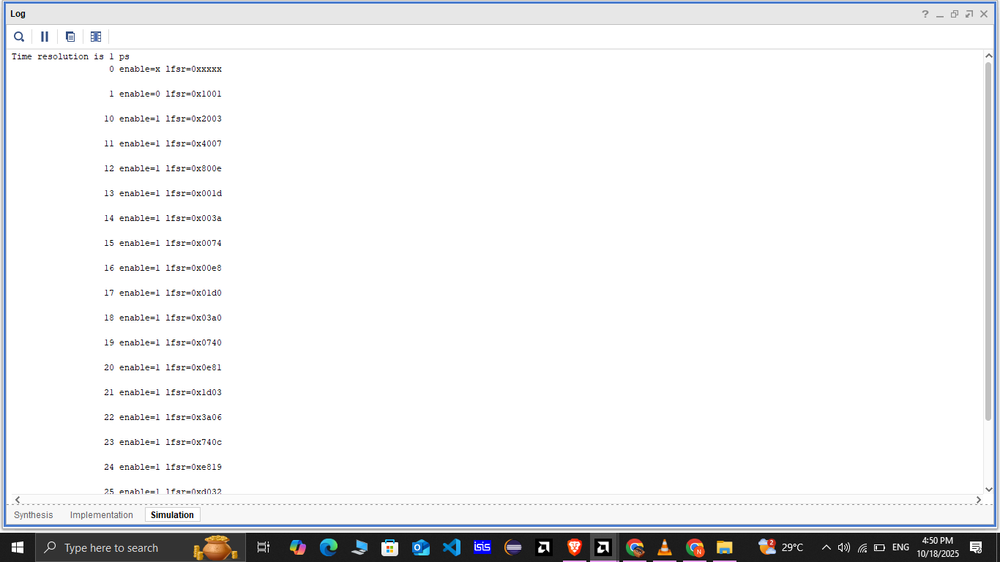

# 🔐 16-bit Linear Feedback Shift Register (LFSR) — Verilog Implementation

## 🧮 Project Description

This project implements a **16-bit Linear Feedback Shift Register (LFSR)** using **Verilog HDL**.
The LFSR generates a **pseudo-random bit sequence** by shifting register bits and feeding back XORed values from selected taps.
It can be used in **cryptography, communication systems, test pattern generation, and built-in self-test (BIST)** applications.

The design includes:

* **Configurable 16-bit LFSR** with selectable feedback taps
* **Pseudo-random sequence generation** using XOR-based feedback logic
* **Synchronous reset** and **load seed** functionality
* **Testbench verification** to ensure correct operation

The accompanying **testbench** (`lfsr_16bit_tb.v`) simulates the LFSR behavior and generates a waveform and console output to visualize the results.

---

### 📁 File Structure

```
16bit_LFSR_Verilog_Project/
├── src/
│   └── lfsr_16bit.v          # Verilog source code for LFSR
├── testbench/
│   └── lfsr_16bit_tb.v             # Testbench to simulate LFSR
├── waveforms/
│   ├── simulation.png         # Simulation waveform
│   └── console_output.png     # Console output screenshot
└── README.md                 # Project documentation
```

---

### ⚙️ Key Features

* 16-bit LFSR with configurable XOR feedback taps
* Pseudo-random bit sequence generation
* Synchronous reset and seed loading
* Compact, efficient hardware design suitable for FPGA/ASIC
* Fully verified using testbench simulation

---

### 🖼️ Simulation Waveform

Below is the waveform showing the LFSR output sequence during simulation (Vivado / ModelSim / GTKWave):


---

### 🖼️ Console Output

Below is the screenshot of the console output from the LFSR testbench (`tb_lfsr.v`), showing the generated pseudo-random sequence:



---

### 💡 Applications

* Stream cipher key generation for encryption
* Pseudo-random bit sequence generation
* Data scrambling in digital communication systems
* Noise simulation for testing
* Built-In Self-Test (BIST) in digital circuits

---

### 🧰 Tools Used

* **Language:** Verilog HDL
* **Simulation Tools:** ModelSim / Xilinx Vivado / Icarus Verilog + GTKWave
* **Platform:** FPGA / HDL simulation environment

---

### 🧠 Learning Outcomes

* Gained practical experience in **sequential circuit design using Verilog**
* Learned the principles of **pseudo-random sequence generation**
* Practiced **writing and running testbenches** for hardware verification
* Developed skills in **waveform and console analysis** to validate LFSR operation
* Understood **feedback tap selection** for maximal-length sequences

---

### 👨‍💻 Author

**NithishKumar B**
B.E. Electronics and Communication Engineering
Sri Krishna College of Engineering and Technology

---

### 🌟 Acknowledgments

Thanks to open-source HDL simulation tools and FPGA communities for providing guidance and resources to implement and test this project.

---

### 💬 Quote

> “Even a simple shift register can produce endless possibilities when combined with the right feedback.”

---
